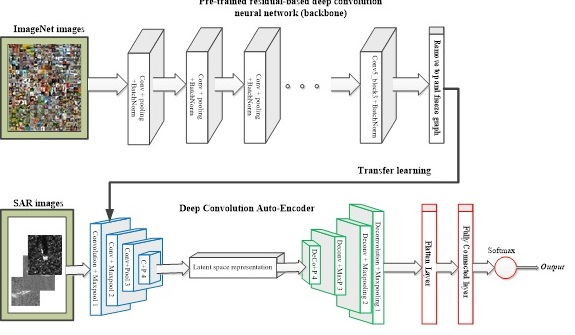

# Fast-Vision-Decoder
An Automatic Target Recognition Model for Synthetic Aperture Radar Images

# Description 
The synthetic aperture radar (SAR) is an all-weather technology used to monitor areas with low to moderate penetration. However, the high-level noise in the SAR images makes it difficult for real-time image interpretation. A number of research works have proposed the development of automatic target recognition algorithms using transfer learning approach to address the issues with SAR imagery. However, the state of the art is sub-optimal, with unclear backbone selection criteria. 

This repository contains the Fast vision decoder (FViD), an object detection model that gives a state of the art performance on tiny SAR dataset. 

# Model

 The fast vision decoder (FViD) is a target recognition model developed with the frozen weights of a residual-based deep convolution neural network backbone, and a convolution autoencoder model. First, the knowledge in the frozen weights of the backbone is used as FViD base model. Secondly, the convolutional layers of the auto-encoder is used to retain the spatial information in the input images. Then the autoencoder architecture is used to  retain the spatial information in the input images and to learn the compressed latent representation. Moreover, a robust backbone selection method is introduced to select a task-specific optimal backbone. The expanded FViD architecture is as shown below.

 
 # Dataset

 [In this notebook](C:\Users\Ayo\Downloads\ship_detection_new.ipynb), the FViD is evaluated using 250 images of ships collected from six TerraSAR-X stripmap-mode synthetic aperture radar, with 2.0 m X 1.5 m resolution in the azimuth direction, acquired in Hongkong area between 2008-2010. The ground truth information from the AIS indicates that the dataset has images of bulk carrier, oil tanker, and container ships, each containing 150, 50, 50 sample images. The dataset is a classic example of a small, imbalance set, a perfect representative data for which the FViD is developed. 

# Novelty

FViD is unique, as it does not have any extra computational burden (the training and evaluation is "fast"). [In this paper](https://papers.ssrn.com/sol3/papers.cfm?abstract_id=4057945), the speed and accuracy of the proposed FViD are further compared with five state of the art models previously used for SAR target recognition tasks, and the comparison result shows that the FViD is faster, and performs better. Moreover, the FViD is evaluated on another dataset (MSTAR), and an ablation study is performed to provide insights into the contribution of FViD architecture.

# System requirements
+ Windows 7
+ Python 3.6+
+ Tensorflow
+ SciPy
+ keras
+ numpy
+ pandas
+ Matplotlib

# Links:
A. Ayodeji et al. " [Fast Vision Decoder: A Robust Automatic Target Recognition Model for SAR Images](https://papers.ssrn.com/sol3/papers.cfm?abstract_id=4057945)".  Preprint, February 2022.
